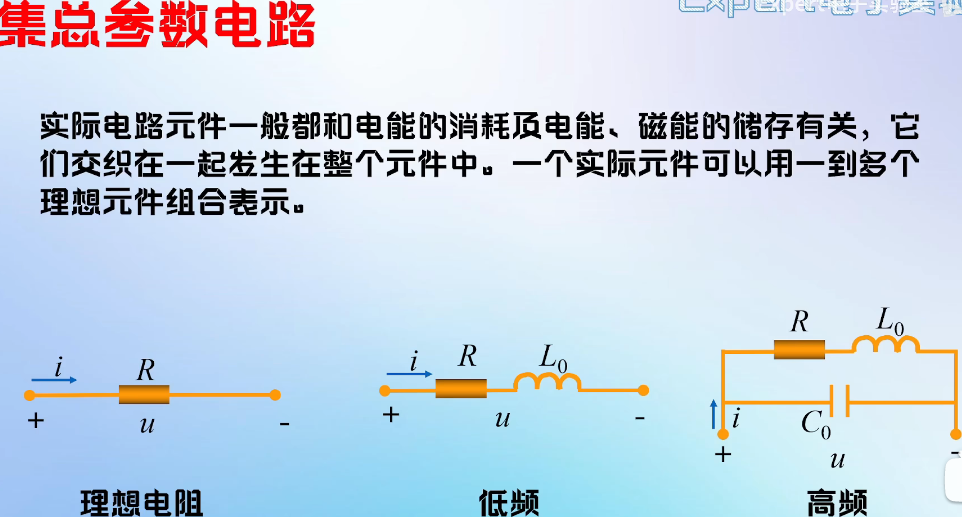
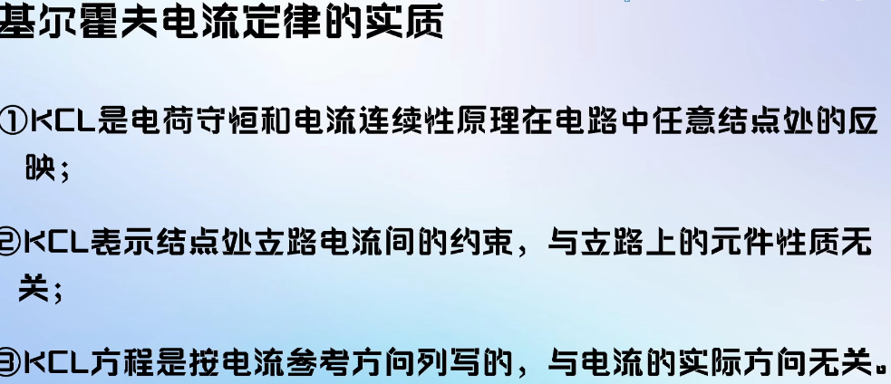
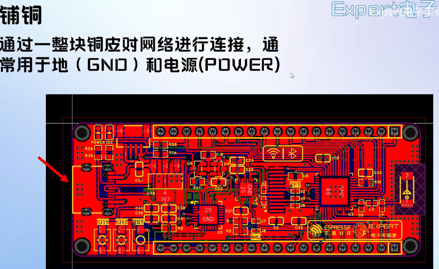
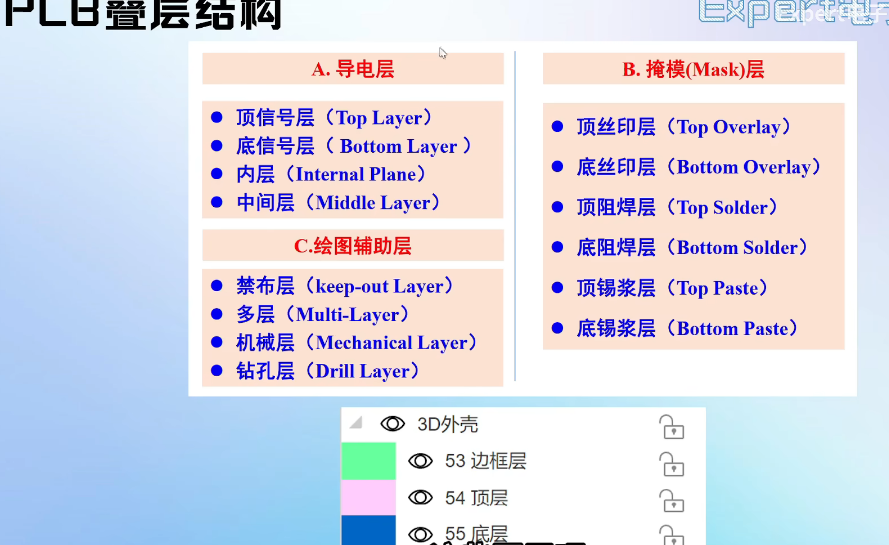

入门软件力创EDA   
# 电路分析基础 #    
***原理图***   
四要素:元件符号，连接线，结点，注释       
# 1.电阻元件(R) #
   
图左 固定电阻，图右 可变电阻(电位器)  
u = iR(R不随温度等变化而变化可用)  
实际电阻图  
   
图左 插接电阻，图右 贴片电阻  
不同封装重要特性(额定功率不同)   
电阻读数   
插接电阻读数   
   
贴片电阻读数  
   
# 2.电容元件(C) #  
  
图左 无极性电容，图右 有极性电容   
电容公式   
   
***通交流隔直流***   
储能和滤波   
电容分类   
    
电容视图  
  
   
   
   
# 3.电感元件(L) #  
    
电感公式  
  
***通直流隔交流***  
滤波扼流谐振储能  
电感分类    
   
插接电感读数   
   
贴片电感读数   
  
# 4.二极管(D) #  
  
二极管其他类型   
  
工作时电压与电流关系    
  
二极管其他类型用途   
  
正负极分辨  
  
# 5.三极管(Q) #  
   
图左NPN型，图右PNP型   
类型区分方式看箭头指向为由P指向N   
NPN内部结构     
   
集电极c与基极b之间形成PN结   
PN结 ：是一种特殊的半导体结，它由两个不同类型的半导体材料(通常是N型和P型)组成，它们在它们的交界面形成一个空间电荷区。PN结具有单向导电性   
三极管输出特性曲线   
   
建立水阀模型理解  
   
截止状态   
   
放大状态  
   
饱和状态  
   
三极管常见封装常见封装   
   
# 6.场效应管(Q) #  
   
结构图  
   
S极为源极,D极为漏极,G极为栅极   
箭头由P指向N,看中间材料,中间材料为N则对应N沟道,中间材料为P则对应P沟道
三极管与场效应管对比   
    
四种MOS管   
   
不同类型场效应管  
  
   
  
   
# 数据手册 #   
数据手册在哪里。   
力创EDA商城搜索元器件名称    
半导小芯查找  

手册内容   
   
# 连接线和结点 #   
连接线(绿色线)表示的是实际电路中的导线，在原理图中虽然是一根线，但在常用的印刷电路板中往往不是线而是各种形状的铜箔条，铜箔块   
结点(红色点)表示几个元件引脚或几条导线相互之间的连接关系。所有和结点相连的元件引脚，导线，不论数目多少，都是导通的   
网络标签(蓝体字)表示一个电气连接点，具有相同网络标签的器件表明是电气连接在一起   
# 基尔霍夫定律 #  
电路定理：基尔霍夫定律   
基尔霍夫定律    
   
集总参数电路   
   
忽略元件之间的相互影响电磁现象只在元件内部影响不会发生相互干扰这样的元件叫做集总参数元件。  
用集总参数模型描述电路的条件：   
1.实际电路的尺寸远小于电路工作时电磁波的波长   
2.非高频情况   
***基尔霍夫电流定律(KCL)***    
基尔霍夫电流定律   
   
KCL推广  
   
KCL实质  
   
***基尔霍夫电压定律(KVL)***   
基尔霍夫电压定律
   
KVL实质    
   
   
# PCB设计基础 #   
# PCB结构与组成 #   
PCB结构    
   
导线   
   
铺铜   
   
过孔   
   
过孔类型   
   
焊盘   
   
丝印   
   
阻焊  
  
PCB叠层结构   
   
图层分类   
   
信号层   
   
丝印层   
   
阻焊层   
   
锡膏层   
   
多层   
   
机械层   
   
板框层   
    
3D外壳层   
    
# 元件的符号与封装 #   
把原理图转化为实际电路板的关键要素是把电路符号转化为实际的PCB封装    
元件三要素    
1.元件符号   
2.元件封装   
3.3D图   
# PCB设计流程 #    
设计流程   
    
PCB布局要求   
   
PCB布线要求   
   
   
PCB布线顺序    
     

 

 

