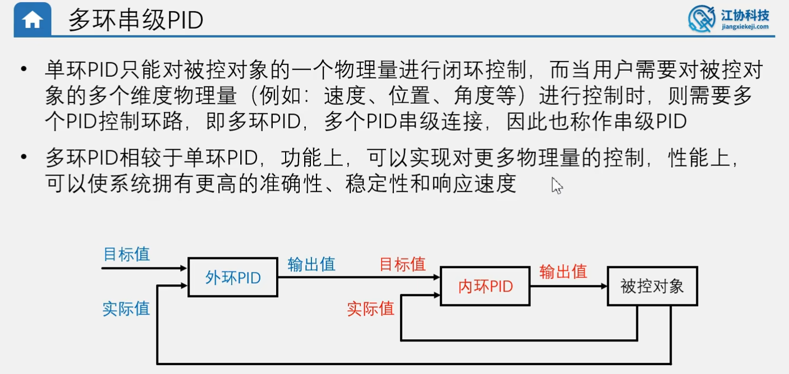
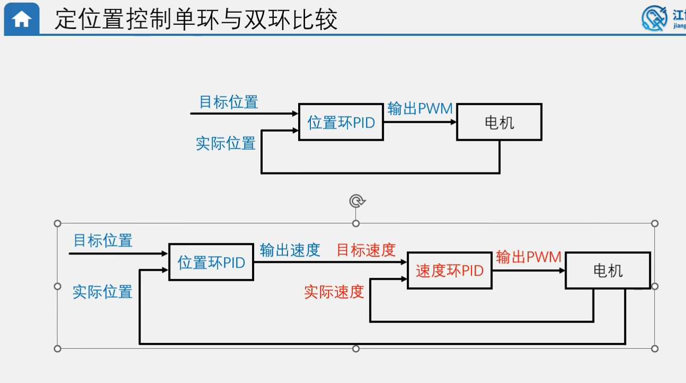
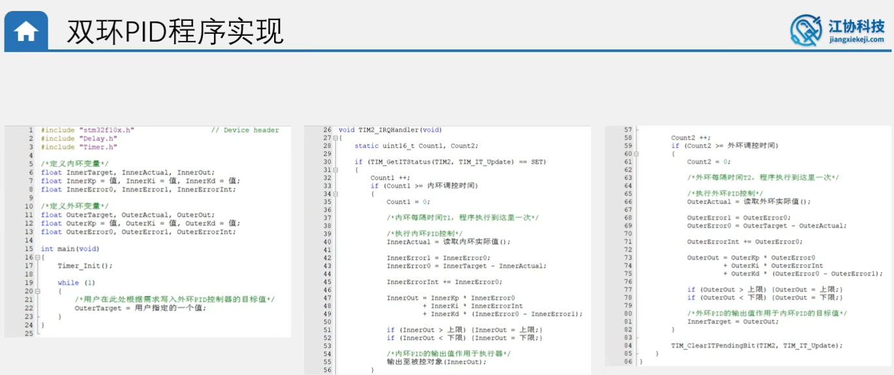
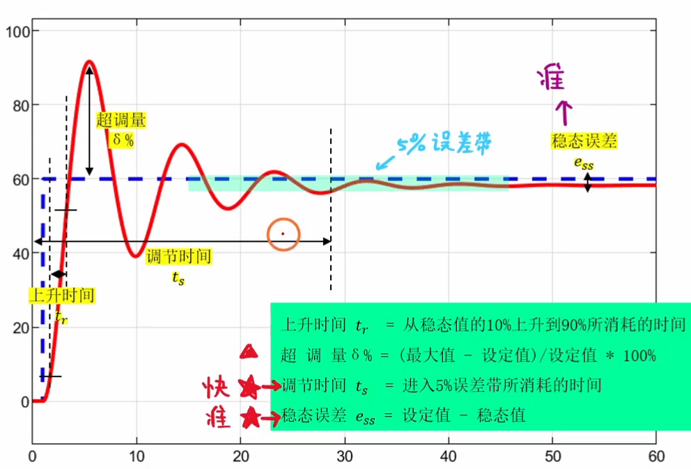
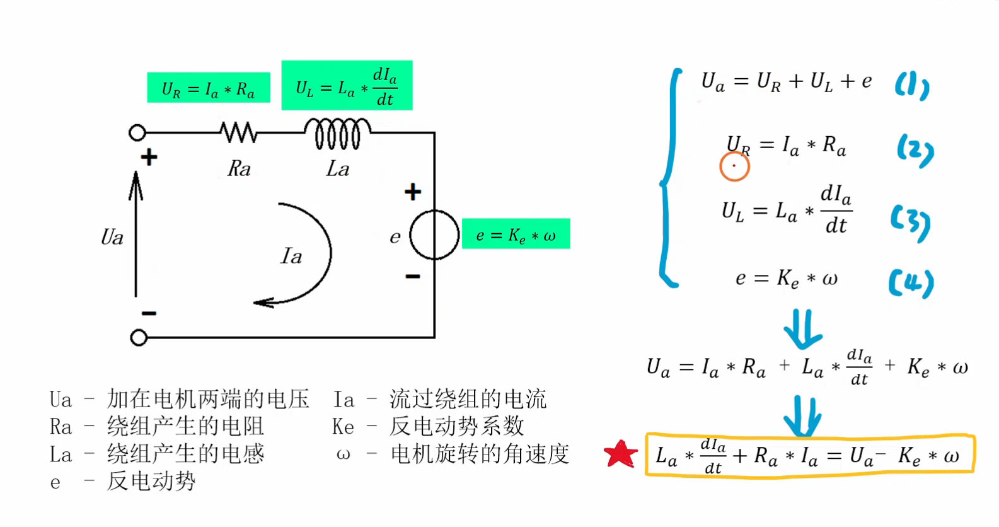
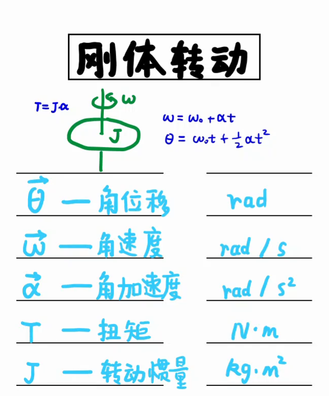
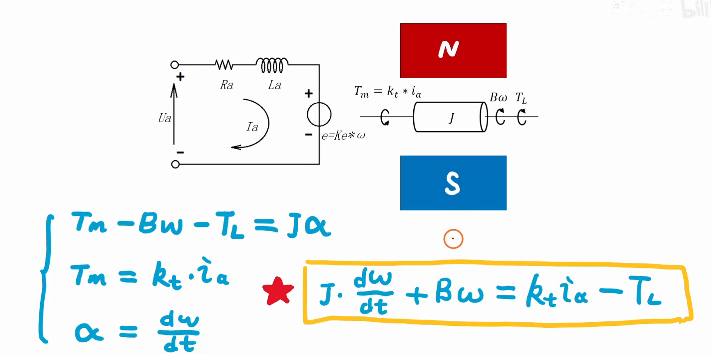
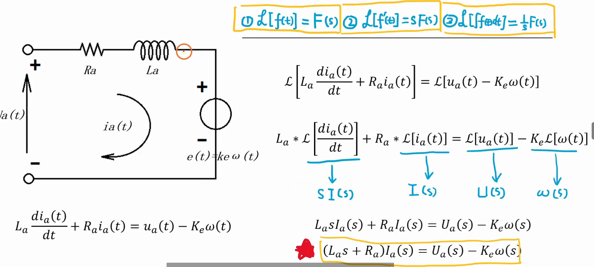
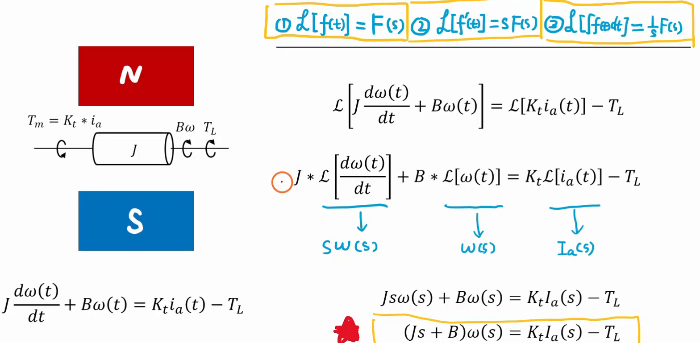

# PID基本原理 #
  
闭环：控制器输出值给被控对象，同时获取被控对象的反馈，控制器知道被控对象的执行状态，可以根据反馈修改输出值以优化控制  
开环：控制器单向输出值给被控对象，不获取被控对象的反馈，控制器对被控对象的执行状态不清楚。   
PID公式
   
根据第二个PID输出值公式:   
(第一项P)比例项：比例项的作用是根据误差的大小来调整输出值，以减小误差。当误差增大时，比例项的输出值也会增大，以加快系统的响应速度。当误差减小时，比例项的输出值也会减小，以减小系统的响应速度。   
   
(第二项I)积分项：积分项的作用是根据误差的累积来调整输出值，以消除稳态误差。当误差累积时，积分项的输出值也会增大，以加快系统的响应速度。当误差减小时，积分项的输出值也会减小，以减小系统的响应速度。 
  
(第三项D)微分项：微分项的作用是根据误差的变化率来调整输出值，以减小误差的变化率。当误差的变化率增大时，微分项的输出值也会增大，以加快系统的响应速度。当误差的变化率减小时，微分项的输出值也会减小，以减小系统的响应速度。   
  
稳态误差   
   
连续形式PID与离散形式PID公式   
连续形式PID公式在单片机中不易实现，因此要将其离散化   
   
位置式PID与增量式PID公式   
位置式PID是连续式PID直接离散得到的最直接最通用的公式   
   
位置式PID与增量式PID的比较   
   
PID程序实现  
   
位置式PID程序实现   
   
增量式PID程序实现   
   
# PID算法改进 #   
   
## 积分项 ##  
积分限幅   
   
积分限幅程序实现   
  
积分分离     
   
积分分离程序实现   
   
变速积分   

变速积分框图解释  
   
变速积分程序实现
  
## 微分项 ##  
不加微分先行时，目标值跳变初期D项相当于推动P项使实际值对目标值跟踪更迅速。（相当于此时D项并不起阻尼作用，反而推动了实际值的改变）  
微分先行  
   
微分先行程序实现
  
不完全微分   
   
不完全微分程序实现
   
## 输入输出 ##   
输出偏移  
  
输出偏移程序实现  
  
输入死区  
  
输入死区程序实现
    
## 多环串级PID ##    
多环串级PID   
     
定位置控制单环与双环比较   
     
双环PID程序实现   
    
# PID数学建模 #    
反应控制系统控制的关键指标（稳，准，快）    

对电机定速进行建模的步骤   
## 电机的电学方程     
电机的电学方程   
     
## 电机的机械方程   
整定电机带动轮胎转动机械方程的前提   
刚体转动的基本原理     
    
T = Ft * r(Ft为切向力，r为半径)T相当于平动中的F     
J = m * r^2     
推导后轮胎转动惯量为J = 1/2 * m * (R1^2 + R2^2)    
推导过程   
    
## 拉普拉斯变换   
拉氏变换规则    
     
电学方程的拉普拉斯变换   
   
机械方程的拉普拉斯变换   
   
## 结构图化简   
将上述拉普拉斯变换后得到的电学与机械方程通过系统结构框图进行化简，得到传递函数   
传递函数等于输出与输入的拉氏变换之比，它反应了系统本身的特性    
电机参数测量   
