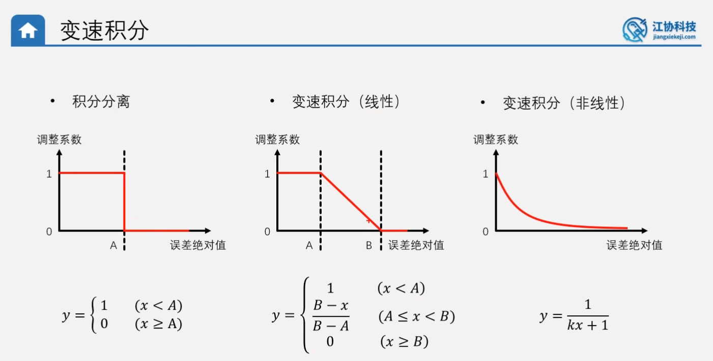
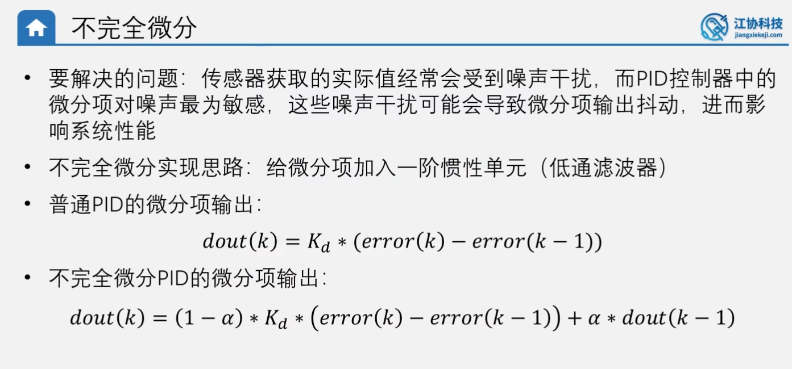

# PID基本原理 #
  
闭环：控制器输出值给被控对象，同时获取被控对象的反馈，控制器知道被控对象的执行状态，可以根据反馈修改输出值以优化控制  
开环：控制器单向输出值给被控对象，不获取被控对象的反馈，控制器对被控对象的执行状态不清楚。   
PID公式
   
根据第二个PID输出值公式:   
(第一项P)比例项：比例项的作用是根据误差的大小来调整输出值，以减小误差。当误差增大时，比例项的输出值也会增大，以加快系统的响应速度。当误差减小时，比例项的输出值也会减小，以减小系统的响应速度。   
   
(第二项I)积分项：积分项的作用是根据误差的累积来调整输出值，以消除稳态误差。当误差累积时，积分项的输出值也会增大，以加快系统的响应速度。当误差减小时，积分项的输出值也会减小，以减小系统的响应速度。 
  
(第三项D)微分项：微分项的作用是根据误差的变化率来调整输出值，以减小误差的变化率。当误差的变化率增大时，微分项的输出值也会增大，以加快系统的响应速度。当误差的变化率减小时，微分项的输出值也会减小，以减小系统的响应速度。   
  
稳态误差   
   
连续形式PID与离散形式PID公式   
连续形式PID公式在单片机中不易实现，因此要将其离散化   
   
位置式PID与增量式PID公式   
位置式PID是连续式PID直接离散得到的最直接最通用的公式   
   
位置式PID与增量式PID的比较   
   
PID程序实现  
   
位置式PID程序实现   
   
增量式PID程序实现   
   
# PID算法改进 #   
   
## 积分项 ##  
积分限幅   
   
积分限幅程序实现   
  
积分分离     
   
积分分离程序实现   
   
变速积分   

变速积分框图解释  
   
变速积分程序实现
  
## 微分项 ##  
不加微分先行时，目标值跳变初期D项相当于推动P项使实际值对目标值跟踪更迅速。（相当于此时D项并不起阻尼作用，反而推动了实际值的改变）  
微分先行  
   
微分先行程序实现
  
不完全微分   
   
不完全微分程序实现
   
## 输入输出 ##   
输出偏移  
  
输出偏移程序实现  
  
输入死区  
  
输入死区程序实现
  