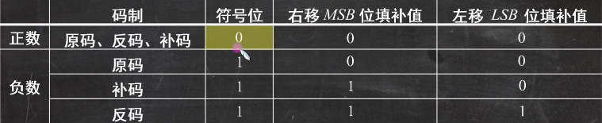

# 一.计算机概述 #   
## 1.计算机重要的硬件部件 ##   
1.冯诺依曼计算机的特点   
（1）计算机由五大部件组成：运算器，控制器，存储器，输入设备，输出设备。  
（2）指令和数据以同等地位存于存储器，可按地址寻访。  
（3）指令和数据用二进制表示。  
（4）指令由操作码和地址码组成。  
（5）存储程序。   
（6）以运算器为中心（现代计算机以存储器为中心）。   
2.冯诺依曼计算机中数据以二进制编码表示原因是  
（1）二进制运算规则简单。  
（2）制造两个稳态的物理器件比较容易。  
（3）便于用逻辑门电路实现算数运算。  
3.计算器重要的硬件部件   
（1）主存储器（MM）。   
a.存储体：数据在存储体内按地址存储。   
b.MAR（存储地址寄存器）：MAR位数反映存储单元的个数。   
c.MDR（存储数据寄存器）：MDR位数反映存储字长。   
相关概念   
存储元：即存储二进制的电子原件，每个存储元可存储1bit。  
存储单元：存储元的组合。   
存储字：存储单元的组合。   
存储字长：存储单元中二进制位数。   
1字节=8bit，1B=1个字节，1b=1位进制。  
（2）运算器。   
a.ACC（累加器）。  
b.MQ（乘商寄存器）。  
c.X（通用操作数寄存器）。  
d.ALU（算术逻辑单元）。  
运算器的主要功能是进行算术运算和逻辑运算。   
（3）控制器。   
a.CU（控制单元）：分析指令，给出控制信号。   
b.IR（指令寄存器）：存放当前指令。   
c.PC（程序计数器）：存放当前指令的地址，有自动加一的功能。   
工作过程：初始时指令和数据存入主存，PC指向第一条指令，主存中取出指令放入IR中，CU分析PC所指指令，给出控制信号，CU发出控制信号，控制单元发出的控制信号控制其他部件工作，完成一条指令，PC自动加1，指向下一条指令，如此循环，直到程序执行结束。   
## 2.计算机系统的层次结构 ##   
1.层次结构   
微程序机器M0（微指令系统）  
传统机器M1（机器语言机器）   
虚拟机器M2（操作系统机器）  
高级机器M3（汇编语言机器）     
虚拟机器M4（高级语言机器） 
## 3.计算机的性能指标 ##   
1.计算机的性能指标   
* 存储容量   
（1）存储器的容量=存储单元个数*存储字长（bit）=存储单元个数*存储字长（8）（Byte）   
（2）相关概念   
n位二进制可以表示2^n种状态   
在存储容量相关题中：1k=2^10，1M=2^20，1G=2^30，1T=2^40。在与事件相关（如传输速率）题中：1k=10^3，1M=10^6，1G=10^9，1T=10^12。   
* CPU的性能指标   
（1）CLK（时钟周期）  
（2）CPU主频 = 1/CLK   
（3）CPI：执行一条指令所需的时钟周期数。   
（4）IPS：每秒可执行指令的条数。IPS=主频/CPI。   
（5）FLOPS：每秒可执行浮点运算的次数。   
（6）执行一条指令的时间 = CPI*CLK。   
（7）CPU执行时间（整个程序耗时）= 程序的总指令条数*CPI*CLK。   
## 4.定点数的运算 ##   
1.移位运算与误差的舍入处理
逻辑移位：不管逻辑左移还是右移，对移出空出位一律补0，对于移出位，不管0，1，一律丢掉   
循环移位：将子妻子的首尾相接进行移位，其移位通路构成一个环路，不管左移还是右移，其移出位都会自动填补到空出位中   
算数移位：针对带符号的移位操作，对于不同表示法的机器码，规则不同，如下表所示
   
## 主存储器 ##   
1.存储器的分类   
（1）按在计算机的层次分类   
**主存储器，又称主存内存**   
CPU可直接随机对其进行访问，其也可以与高速缓冲存储器和辅助存储器交换数据   
**辅助存储器，又称辅存外存**   
辅存的内容需调入主存才能被CPU访问   
**高速缓冲存储器，简称cache**   
位于主存与CPU之间，用来存放当前CPU经常使用的指令和数据，以便CPU能告诉访问它们   
（2）按存储介质分类   
分为磁表面存储器（磁盘，磁带），半导体存储器和光存储器（光盘）。   
（3）按存取方式分类   
**随机存储器（RAM）**   
存储器的任何一个存储单元都可以随机存取，且存取时间与存储单元的物理位置无关RAM又分为静态RAM（SRAM）和动态RAM（DRAM）   
**只读存储器（ROM）**   
存储器的内容只能随机读出而不能写入，ROM与RAM的存取方式  均为随机存取，ROM信息写入后就固定不变，即使断电也不会丢失   
**串行访问存储器**   
包括顺序存取存储器SAM（磁带）和直接存取存储器DAM（磁盘）   
（4）按信息的可保存性分类  
易失性存储器（断电后存储信息消失）：RAM   
非易失性存储器（断电后信息仍然保留）：ROM，磁盘，光盘  
破坏性读出（某个存储单元的信息被读出时，原存储信息被破坏）：半导体存储器   
非破坏性读出（读出时原存储单元信息不变）：磁盘    
2.存储器的性能指标   
(1)存储容量=存出字数*字长（1k*8位）   
(2)存储速度：   
数据传输率=数据的宽度/存储周期   
存取时间：存取时间是指从启动一次存储操作到存储操作结束所需要的时间，分为读出时间和写入时间   
存取周期：存取周期又称读写周期或访问周期。是指从启动一次存储器的读写操作到下一次存储器的读写操作开始所需的时间。   
主存带宽：主存带宽又称数据传输率，表示每秒从主存进出信息的最大数量，单位为位/秒（b/s），字节/秒（B/s）   
3.存储系统的层次  
a.cache主存层速度接近于cache，容量和价格接近于主存。主存辅存层速度接近于主存，容量和价格接近于辅存。   
b.主存与cache之间的数据调动由硬件自动完成，对所有程序员是透明的，主存与赋存之间的数据调动是由硬件和操作系统共同完成的，对应用程序员是透明的。   
c.cache主存层与主存辅存层中，上一层的内容知识下一层内容的副本  
4.半导体随机存储器  
静态随机存储器（SRAM）：存储元是用双稳态触发器来记忆信息，信息被读出后，其信息不会被破坏。特点：存取速度快，成本高，功耗大，一般用于高速缓冲存储器。   
动态随机存储器（DRAM）：存储元是用电容来记忆信息，电容上的电荷只能维持1~2ms，即使电源不断电信息也会自动消失，每隔一段时间必须刷新，一般用于主存。   
**DRAM的刷新方式**   
（1）集中刷新：在一个刷新周期内，利用一段固定的时间，依次对存储器的所有行进行逐一再生，在此期间停止对存储器的读写操作，称为“死时间”又称访存“死区”优点是读写操作时不受刷新工作的影响；缺点是在集中刷新期间不能访问存储器   
（2）分散刷新：把对每行的刷新分散到各个周期中将一个存储器的系统工作周期分为两部分，前半部分用于正常读写，后半部分用于刷新。优点是没有死区，缺点是加长了系统的存取周期，降低了整机的速度   
（3）异步刷新：前两种方法的结合体，在正常读写的同时，每隔一段时间对存储器进行刷新。避免CPU等待过长时间，减少刷新次数，提高整机工作效率   
**主存容量的扩展**   
（1）位扩展法   
将多个存储芯片的地址段，片选端和读写控制端相应并联，数据段分别引出与CPU相连   
（2）字扩展法   
将多个存储芯片的地址段，片选端和读写控制端相应并联，数据段并联，然后将多个存储芯片的数据线并联。   
（3）存储容量扩展法   
将多个存储芯片的地址段，片选端和读写控制端相应并联，数据段并联，然后将多个存储芯片的数据线并联。  
## 辅存与cache ##   
**磁盘存储器**   
1.磁盘的组成   
（1）磁盘驱动器  
（2）磁盘控制器   
（3）存储区域：一块硬盘有若干记录面，每个记录面划分为若干磁道，每条磁道又划分为若干扇区，扇区是磁盘读写的最小单位，即磁盘按块存取。   
a.磁头数：即记录面数，表示磁盘共有多少个磁头，磁头用于读取写入盘片记录面的信息，一个记录面对应一个磁头。   
b.柱面数：表示硬盘每面盘片上有多少个磁道。在一个盘组中，不同记录面的相同编号的磁道构成一个圆柱面。   
c.扇区数：表示每条磁道上有多少个扇区。   
2.磁盘的性能指标   
（1）记录密度   
道密度：沿磁盘半径方向单位长度上的磁道数。   
位密度：磁道单位长度上能记录的二进制代码位数。   
面密度：位密度和道密度的乘积。   
（2）磁盘的容量   
非格式化磁盘的容量=磁盘记录面数*磁道数*磁道容量=磁盘记录面数*道密度*盘片有效半径*位密度*磁道周长   
格式化磁盘 的容量=磁盘记录面数*磁道数*每道扇区数*扇区容量   
注：格式化指为磁盘划分扇区，并增加管理位；   
格式化后的容量要比非格式化的容量小。   
（3）平均存取时间   
平均存取时间=寻道时间+旋转延迟时间+传输时间  
寻道时间：磁头移动到目的磁道的时间。   
传输时间：传输数据所花费的时间    
（4）数据传输率   
假设磁盘转速为r转/秒，每条磁道容量为N字节，则数据传输率为Dr=N*r    
3.优缺点   
优点：容量大价格低，记录介质可重复使用，记录信息可长期保存，非破坏性读出。   
缺点：存取速度慢，机械结构复杂   
4.磁盘地址：主机向磁盘控制器发送寻址信息   
驱动器号+柱面（磁道）号+盘面号+扇区号   
5.磁盘的工作过程   
磁盘的主要操作是寻址，读盘，写盘。每个操作对应一个控制字，硬盘工作时，第一步是取控制字，第二步是执行控制字。    
硬盘属于机械式部件读写操作是串行的，不能在同一时刻即读又写，也不能在同一时刻读两组数据或写两组数据。   
！***高速缓冲存储器*** ！   
cache    
时间局部性：最近的未来要用的信息可能是现在正在使用的信息。   
空间局部性：最近的未来要用的信息可能与现在正在使用的信息在存储空间上是临近。   
1.相关概念    
块：为了便于cache与主存之间交换信息，cache和主存都被划分为相等的块，cache块又称为cache行，每个块由若干个字节组成，块的称读称为块长   
读操作：当CPU发出读请求时，若访问地址在cache中命中，就将此地址换成cache地址，直接对cache进行读操作，与主存无关，若cache中没有命中，则仍需访问主存，并把此字所在的块一次性的调入cache中。注：CPU与cache之间的数据交换以字为单位，而cache与主存之间的数据交换以cache块为单位。   
写操作：全写法和回写法。   
命中率：cache的命中次数为Nc，访问主存的总次数为Nm，则命中率H为Nc/(Nc+Nm)    
平均访问时间：Tc为命中cache的访问时间，Tm为未命中cache的访问时间，则平均访问时间为T=H*Tc+(1-H)*Tm    
2.cache和主存的映射方式   
（1）全相联映射   
最灵活，cache利用率最高，成本最高     
通常采用目录表记录主存块之间的映射关系，主要包括三个部分：主存块号，cache块号和有效位。   
（2）直接映射   
直接地址映射是指主存中的块只能映射到cache中某个固定的块中，主存块号与cache块号之间的映射关系是固定的。   
主存地址由三部分组成：区号，区内块号和块内地址   
（3）组相联映射   
组相联映射=全相联映射+直接相联映射   
在地址映射时，组间为直接相联映射，组内为全相联映射。   
CPU发出的访存地址被分解为：区号S，组号G，组内块号B，块内地址A。   
cache的地址可分解为：组号G，组内块号B，块内地址A。   
注：n路组相联是指：每组有n块。   
（4）三种映射方式的对比   
a.直接映射的命中率最低，全相联映射的命中率最高。   
b.直接映射的判断开销最小，所需时间最短，全相联映射的判断开销最大，所需时间最长。    
c.直接映射标记所占的额外空间开销最少，全相联映射标记所占的额外空间开销最大。    
3.cache的替换策略   
常用的替换算法有随机算法，先进先出算法，近期最少使用算法和最不经常使用算法。   
（1）随机算法：随机的确定替换的cache块。实现简单，未依据程序访问的局部性原理命中率低。   
（2）先进先出算法：选择最早调用的进行替换，比较容易实现。也未依据程序访问的局部性原理。最早进入的主存块也可能是经常使用的。   
（3）近期最少使用算法（LRU）：依据程序访问的局部性原理，选择近期最少使用的cache块进行替换。平均命中率高，是堆栈类算法.      
计数器的变化规则：命中时，所命中的行的计数器清零，比其低的计数器加一其余不变。   未命中且还有空闲行时，新装入的行的计数器置0，其余全加一。    命中且无空闲行，计数值最大的行信息被淘汰，新装入的行计数值置零其余全部加一。  
4.cache的写操作   
原因：因为cache内容为主存副本，当cache内容更改时，需要写操作使cache内容与主存一致。   
（1）cache写命中   
全写法：cache写命中时，cache和主存内容均被更改。   
优点：随时保持主存数据的准确性。  
缺点：增加访问次数，降低了cache的命中率。   
回写法：cache写命中时，只更改cache内容，不立即写入主存中，只有当此块被换出时才会写回主存。   
优点：减少访存次数。
缺点：存在数据不一致的隐患。   
(2)cache写不命中   
写分配法：加载主存的块到cache中然后更新此cache块。   
非写分配法：只写入主存，不进行调块。   
注：非写分配法通常与全写法合用；写分配法通常与回写法合用。   
**虚拟存储器**   
1.基本原理   
虚拟存储器技术时将一部分磁盘空间作为主存来使用，此时程序员使用的地址为虚拟地址（逻辑地址），对应空间也被称为虚拟地址空间（逻辑地址空间）；贮存地址称为物理地址（实地址），对应空间称为物理地址空间（实地址空间）。   
虚拟存储器的基本思路：在程序执行时，按照执行的顺序将程序的一部分调入主存，其它部分则保存在辅存中，当需要执行在辅存中的程序段时，由CPU按照某种调度算法以页，段为单位调入主存。   
虚拟存储器与cache的区别   
设计目的：扩大容量/提高速度     
实现手段：操作系统和硬件/硬件实现    
透明性：对应用程序员透明，对操作系统程序员不透明/对系统程序员和应用程序员都透明     
数据块大小：大小可由用户决定/大小固定     
减缓频率：低/高   
数据通路：与CPU之间不存在直接的数据通路/由直接访问通路   
## 系统总线 ##    
1.总线的基本概念   
（1）定义   
总线（bus）是计算机各种功能部件之间传送信息的公共通信干线，他是由导线组成的传输线束。   
总线上所链接的设备，按对其有无控制能力可分为主设备和从设备两种。  
主设备：总线的主设备是指获得东线楼职权的设备。  
从设备：总线的从设备是指被主设备访问的设备，他只能响应主设备发来的各种总线指令。   
（2）总线的分类  
**按功能** 
a.片内总线：芯片内的总线，是CPU芯片内部寄存器与寄存器之间，寄存器与ALU之间的公共连接线。   
b.系统总线：计算机系统各功能部件（CPU，主存，IO接口 ）之间相互链接的总线        
根据传输数据的不同分为   
数据总线：传输数据   
地址总线：指出个类数据的地址   
控制总线：发出各种控制信号   
c.通信总线：计算机系统之间或计算机系统与其它系统之间传输信息的总线，通信总线也称外部总线，通信总线也称外部总线。          
**按数据传输格式**   
串行总线：数据在单条1位宽的传输线上，一位一位按顺序分时发送。   
并行总线：数据在多条并行1位宽的传输线上，同时传送。   
**按时序控制方式**    
同步总线   
异步总线   
2.总线的特性   
（1）物理特性   
（2）电气特性  
（3）功能特性  
（4）时序特性    
3.总线的性能指标   
（1）总线的带宽：单位时间内总线上传送的数据量。   
总线的带宽=总线的工作频率*总线的位宽/8   
总线的带宽=总线的位宽/8/总线周期   
（2）总线的位宽：总线能同事传送的二进制数据的位数   
（3）总线的工作频率：总线的工作时钟频率以MHZ为单位。  
例：某总线共有88根信号线，其中数据总线为32bit，地址总线为20bit，控制总线为36根，总线的工作频率为66MHZ，则总线宽度为32bit，传输速率为66MHZ*32bit/8=264MB/s。  
4.总线结构   
（1）单总线结构  
单总线结构是将CPU，主存以及I/O设备都挂在一组总线上，允许IO设备之间，IO设备与CPU之间或PO设备与主存之间直接交换信息。   
（2）双总线结构   
双总线结构是将速度比较第的IO设备从单总线上分离出来，形成主存总线与IO总线分开的结构，通道为特殊功能存储器，完成外部设备与主存储器之间的数据传送，双总线结构用于大中型计算机系统。   
（3）三总线结构   
主存总线用于CPU与主存之间，IO总线用于CPU和各类IO信息之间，DMA总线用于主存与高速IO设备之间。   
主存总线与DMA总线不能同时对主存进行存取，IO总线只有在CPU执行IO指令时才用到。    
（4）四总线结构    
高速总线上挂接着高速IO设备，对于高速IO设备而言，减少对CPU的依赖，同时又比扩展总线上的设备靠近CPU提高各自的效率。   
**5.总线控制**   
（1）总线判优控制   
总线判优控制分为集中式和分布式，其中集中式有分为   
链式查询，计数器定时查询，独立请求方式   
链式查询   
流程：主设备发送请求信号，若多个主设备请求总线，则由总线控制器的判优，仲裁逻辑按照一定的优先等级确定哪个主设备能够使用总线，获得总线控制权的主设备开始传送数据。   
优先级：离总线控制器越近的设备优先级越高。  
优缺点：优点是优先级固定，只需要简单几条控制线，结构简单，易于扩充。缺点是对硬件电路的故障敏感，且优先级无法改变当优先级较高的设备频繁请求时，优先级较低的设备无法得到响应。    
计数器定时查询    
流程：当总线控制收到请求信号，判断总线空间时，计数器开始计数，计数值通过设备地址发送到各个设备，当地直线的计数值与请求总线的设备地址一致时，获得总线控制权，同时终止计数以及查询。   
优点与缺点：优点是计数初始值可以改变优先次序，对电路故障没有链式的敏感。缺点是增加了控制线数，控制比链式查询复杂。   
独立请求   
每一对设备均有：总线请求线BRi和总线允许线BGi   
流程：当总线上有部件需要使用总线时，经各自的总线请求线发送总线请求信号，在总线控制中排队。当总线控制器依次按照某个顺序决定批准某个部件请求，则给该部件发送总线响应信号。   
优点与缺点：优点响应速度块，总线允许信号直接从控制器发送到有关设备，不必在涉笔间传递或者查询，对优先次序的控制相对灵活。缺点控制线数较多，总线控制逻辑相对复杂。   
（2）总线通信控制    
总线周期的四个阶段    
申请分配阶段：由需要使用总线的主要模块提出申请，经总线仲裁机构决定下一传输周期的总线使用权授予某一申请者    
寻址阶段：获得使用权的主模块通过总线发出本次要访问的模块地址和有关命令启动本次传输的从模块   
传输阶段：主模块和从模块进行数据交换，可单向可双向进行数据传送   
结束阶段：主模块的有关信息从系统总线上删除，让出总线使用权   
通常有四种方式：同步通信，异步通信，半同步通信和分离式通信   
例：在异步串行传输系统中，字符由一位起始位，八位数据位，一位奇偶校验位，两位终止位构成。若要求每秒传送120个字符，求传送的波特率为____比特率为____.    
波特率是指单位时间内传送的二进制的位数即1+8+1+2=12位。12 * 120=1440波特。   
比特率是指单位时间内传送二进制有效数据的位数即8位。8 * 120=960比特。   