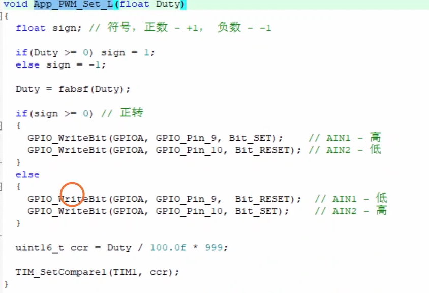
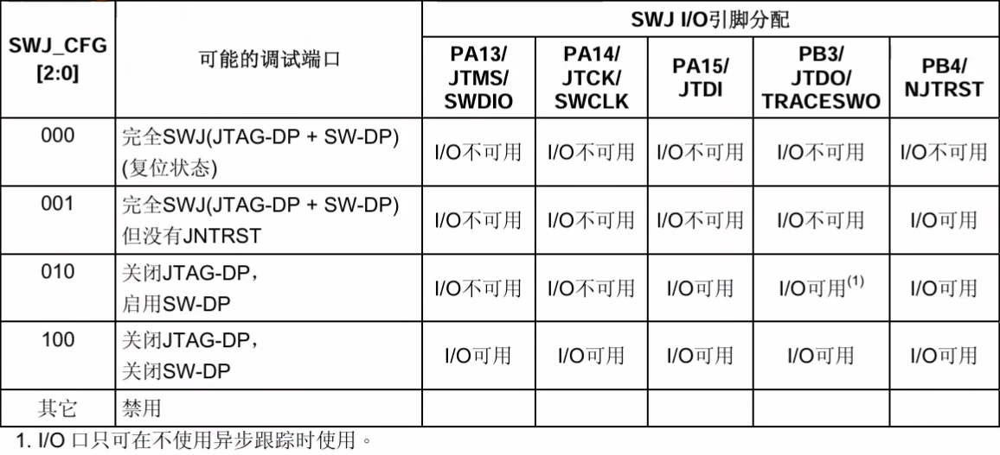
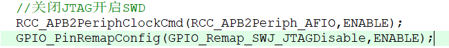
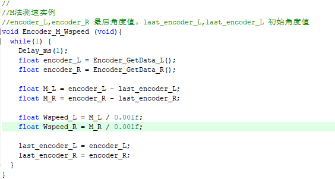

# 电机调速 #   
H桥电路   
通过单片机输出不同占空比的PWM波来实现电机不同的转速    
以tb6612为例，其AIN1与AIN2，BIN1与BIN2分别控制电机的正反转，PWM波的占空比决定了电机的转速。    
AIN1与AIN2，BIN1与BIN2用通用推挽输出。   
PWA与PWB用复用推挽输出。   
## PWM ##   
stm32f103     
PWM波的三个重要参数：周期，占空比，分辨率。   
周期：PWM波的周期，tb6612驱动时周期设置越短越好即预分频值（PSC）设置为0。     
占空比：高电平的时间占整个周期的比例，单位为%。   
分辨率：占空比的最小单位，单位为%。分辨率设置为1000即自动重装载寄存器（ARR）设置为999。   
设置CCRx的值来改变占空比。    
占空比 = CCRx / ARR  * 100   
  
Duty为占空比   
# 电机转速测量 #   
霍尔式编码器    
中间有一个磁体，将其均分为十一对磁环，磁体旁边有两个霍尔传感器，称为A相和B相，A相B相相位相差九十度，以此可判断转动的方向。   
## 补充知识 ##   
stm32f103c8t6引脚分配中，JTAG下载模式下占用PB3,PB4,PA15,PA14,PA13五个引脚。SWD下载模式下占用PA13，PA14两个引脚。当用SWD下载模式时，可选择关闭JTAG下载以空出三个引脚，方法为使用重映射。     
  
具体代码示例   
  
## M法测速   适用于高速转动的电机   
测速时首先要将编码器值换算为角度值   
具体的方法为，对十一对磁环的编码器为例   
将encoder（）值 / 22 /减速比 * 360 即可得到角度值。得到角度值后，进而计算角速度值，公式为： 角度/时间间隔 当时间间隔足够小时即为当前时刻的角速度值。（一般设置时间间隔为一毫秒）   
误差分析：由于编码器是由电机带动的，所以在启动前和制动后，编码值都会漏测一小段数值，从而导致误差。    
因此该方法在速度快时误差小，因为速度快单位时间内encoder（）值就越大，误差所占比例就越小。
M法测速实例代码    
  
## T法测速   适用于低速转动的电机    
该法与M法相反，即测单位encoder（）值所对应的时间，再换算为角速度值   
公式为： 1/时间间隔 / 22 / 减速比 * 360   
误差分析：由于单片机时钟分辨率限制，对时间间隔测量不准确导致产生误差，所以当当低速转动时时间间隔增大，同样的误差所占比例减少，从而减少误差。   
